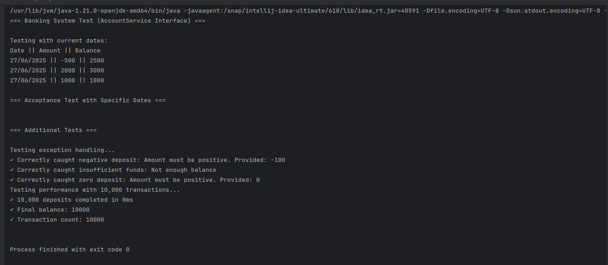

# Banking System

A simple Java banking application that lets you deposit money, withdraw money, and view your account statement.

## What it does

- **Deposit**: Add money to your account
- **Withdraw**: Take money out (if you have enough balance)
- **Statement**: See all your transactions

## How to run

1. Compile: `javac src/org/example/*.java src/org/example/services/*.java src/org/example/entites/*.java`
2. Run: `java org.example.AccountTest`

## Example Output

```
=== Banking System Test ===

Testing with current dates:
Date || Amount || Balance
27/06/2025 || -500 || 2500
27/06/2025 || 2000 || 3000
27/06/2025 || 1000 || 1000

Testing exception handling...
✓ Correctly caught negative deposit: Amount must be positive. Provided: -100
✓ Correctly caught insufficient funds: Not enough balance
✓ Correctly caught zero deposit: Amount must be positive. Provided: 0

Testing performance with 10,000 transactions...
✓ 10,000 deposits completed in 45ms
✓ Final balance: 10000
```
### Results
<p align="center">
  
</p>

## How to use

```java
AccountService account = new Account();

account.disposit(1000);    // Add $1000
account.withdraw(500);     // Take out $500
account.printStatement();  // Show transactions
```

## Files

- `Account.java` - Main banking code
- `AccountService.java` - Interface
- `Transaction.java` - Stores transaction info
- `AccountTest.java` - Test the system

## Features

✅ Safe deposits and withdrawals  
✅ Transaction history  
✅ Error checking  
✅ Fast performance